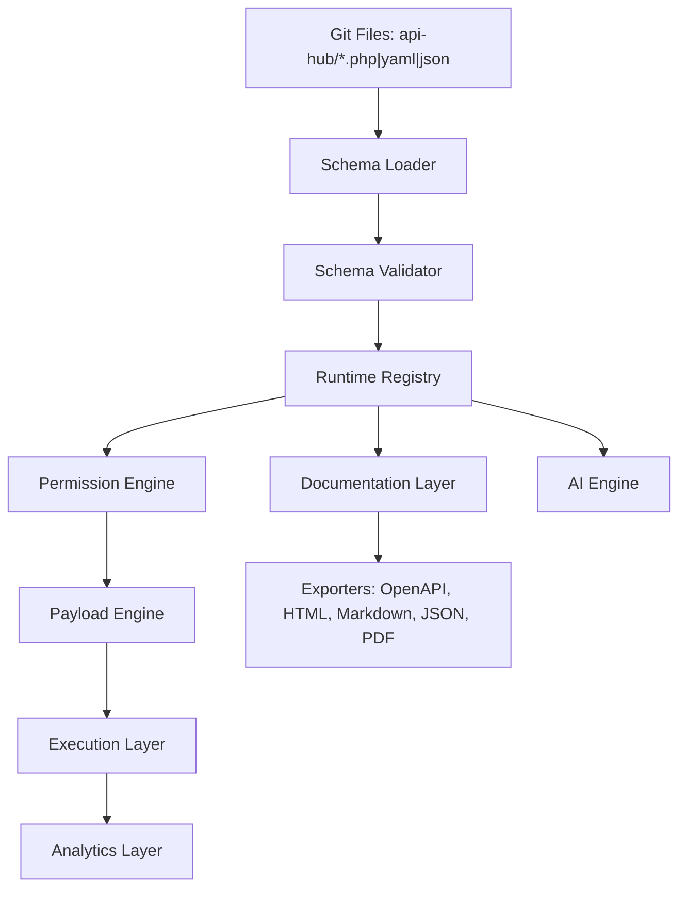
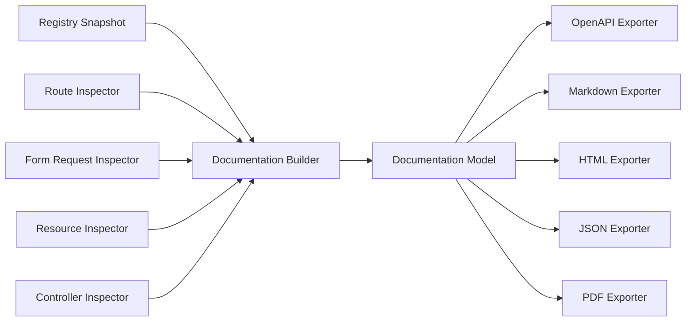
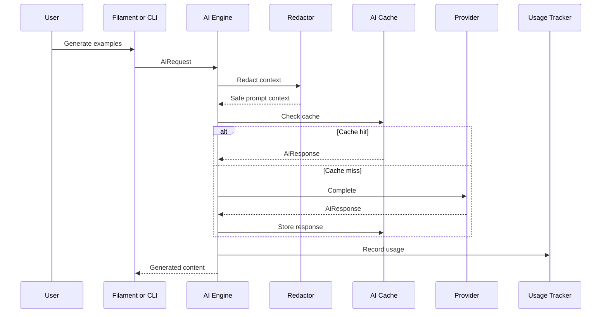

# Laravel API Intelligence Hub Blueprint

Vendor: `acrosoft`  
Package: `laravel-api-intelligence-hub`  
Composer: `acrosoft/laravel-api-intelligence-hub`  
Target: Laravel 11, Laravel 12, PHP 8.3+

## 1. Product Definition

Laravel API Intelligence Hub is a Git-based, AI-powered, runtime API management platform for Laravel. It is not a Swagger clone, a Postman clone, or a static documentation generator. It is an API operating system for Laravel applications: schemas live in Git, are compiled into a runtime registry, are enforced at request time, are documented automatically, can be tested from a UI, and are governed through permissions, payload policy, analytics, API keys, and AI assistance.

The package must be installable with:

```bash
php artisan apihub:install
```

The installation command configures the API registry, schema directory, documentation engine, testing UI, AI integration, signed API key management, analytics, permissions, payload controls, schema management, Filament resources, cache configuration, migrations for optional logging, and default policies.

## 1.1 PRD

### Problem

Laravel teams often assemble API documentation, request testing, API keys, analytics, governance, and AI assistance from separate tools. Those tools usually drift from the actual Laravel runtime, store API contracts outside Git, or cannot enforce field-level behavior at request time. The result is stale documentation, weak governance, duplicated configuration, and poor visibility into how APIs behave in production.

### Product Goal

Create a single Laravel package that turns API definitions into versioned code, compiles them into a runtime registry, enforces them through middleware, exposes them through documentation and testing experiences, and augments developer workflows with safe AI assistance.

### Success Metrics

- A developer can install and publish the package in under 5 minutes.
- A developer can define, document, secure, and test a new endpoint from a schema file in under 15 minutes.
- Cached registry endpoint lookup stays under 1 ms p95.
- Full runtime middleware overhead stays under 5 ms p95 with cache-backed revocation checks.
- Documentation export succeeds for 1,000 endpoints in under 10 seconds on a CI baseline.
- Test coverage remains above 90%, with critical security modules at or near 100%.
- No runtime database dependency is required for schema lookup, docs generation, key verification, or permission checks.

### Functional Requirements

- The package must load API definitions from files.
- The package must validate schemas before publishing or caching.
- The package must compile schemas into a queryable runtime registry.
- The package must generate API documentation from registry, routes, requests, resources, and controller metadata.
- The package must export OpenAPI, Swagger UI-compatible docs, Markdown, HTML, JSON, and PDF.
- The package must issue signed API keys with scopes, permissions, expiry, rate profile, mode, rotation, and revocation support.
- The package must enforce endpoint, role, scope, payload, and field-level permissions.
- The package must transform, inject, override, validate, hide, and mask payload fields.
- The package must provide a testing UI with collections, folders, environments, variables, saved requests, and history.
- The package must record analytics with database and Redis drivers.
- The package must provide AI provider abstraction, response caching, usage tracking, and prompt redaction.
- The package must expose Filament admin pages for docs, tester, schemas, keys, permissions, analytics, AI settings, and system settings.
- The package must expose a plugin system for providers, exporters, schema processors, payload transformers, analytics drivers, test generators, and Filament extensions.

### Non-Functional Requirements

- PHP 8.3+ only.
- Laravel 11 and 12 support.
- Source-of-truth API configuration must remain file-based.
- Runtime registry must support production caching.
- Security-sensitive decisions must be deterministic and testable.
- AI-generated output must never be automatically trusted for security policy.
- Filament must be optional enough that non-admin package usage still works.
- Storage drivers must be replaceable behind contracts.
- Public contracts must be stable before `1.0`.

### Prioritization

- P0: schema loader, validator, registry, cache, docs model, signed keys, permission middleware, payload middleware, install command, test suite.
- P1: OpenAPI/Markdown/HTML/JSON exporters, Filament docs, analytics database driver, AI provider abstraction, key commands.
- P2: tester UI, Redis analytics, PDF exporter, Swagger UI, plugin registry, AI-generated examples.
- P3: advanced collaboration, governance workflows, SDK snippets, contract diff UI, enterprise dashboards.

### Non-Goals

- Replacing Laravel routing.
- Replacing application authentication.
- Becoming a hosted API gateway in the open-source package.
- Making OpenAPI the internal source of truth.
- Automatically modifying application controllers.
- Sending production secrets to AI providers.

## 2. Product Principles

Files are the source of truth. The database is not the primary configuration store.

The runtime architecture is:



Core principles:

- API definitions are versioned, reviewable, diffable, and deployable.
- Runtime state is compiled from files, not hand-maintained in database rows.
- Package features are modular and replaceable through contracts.
- The open-source core must be useful alone; Pro features should extend scale, governance, automation, and collaboration.
- Security controls must be enforceable in middleware and auditable through logs.
- AI assists developers but never becomes an authority for access control, validation, or secrets.

## 3. Target Users

Primary users:

- Laravel teams building API-first SaaS products.
- Internal platform teams standardizing API governance.
- Agencies maintaining many Laravel APIs.
- Enterprise teams that need docs, testing, permissions, analytics, and key governance without adopting a separate API gateway first.

Secondary users:

- Package authors who want a plugin surface.
- DevOps teams who want API definitions in Git.
- Security teams who need field-level controls and auditable API keys.

## 4. MVP Scope

The MVP should deliver a coherent core that works end to end:

- File-based schemas in `api-hub/`.
- Schema validation, loading, inheritance, composition, and version metadata.
- Runtime registry with cache and lazy loading.
- Documentation generation from schemas and Laravel routes.
- OpenAPI, JSON, Markdown, and HTML export.
- Signed API keys with scopes, expiry, revocation cache, and rotation.
- Permission middleware for roles, scopes, endpoints, and fields.
- Payload control middleware for hiding, injecting, transforming, overriding, and validating fields.
- Basic testing UI inside Filament.
- Basic analytics middleware with optional database and Redis drivers.
- AI provider abstraction with OpenAI, Anthropic, Gemini, and OpenRouter adapters.
- AI cache and usage tracking.
- CLI commands for install, scan, docs, test, cache, clear, key create, key revoke, and analytics.
- Pest test suite covering core behavior.

Out of MVP:

- Multi-tenant Pro governance workflows.
- Cloud sync.
- Hosted collaboration.
- Advanced performance baselining.
- Visual API contract diff UI.
- Full SDK generation.

## 5. Module Map

### Module 1: API Registry Engine

Responsibilities:

- Discover schema files.
- Load schemas through typed loaders.
- Validate schema structure.
- Compile normalized endpoint metadata.
- Expose query APIs for docs, middleware, testing, analytics, and Filament.
- Cache compiled registry.
- Support hot reload in local environments.
- Support lazy endpoint loading in production.
- Invalidate cache by file hash, package version, app route cache timestamp, and config hash.

Key classes:

- `ApiRegistry`
- `SchemaRepository`
- `SchemaCompiler`
- `RegistryCache`
- `EndpointDescriptor`
- `RegistrySnapshot`

### Module 2: Schema Definition Engine

Supported formats:

- PHP arrays for first-class Laravel ergonomics.
- YAML as optional driver.
- JSON as optional driver.

Example:

```php
<?php

return [
    'name' => 'Create Job',
    'method' => 'POST',
    'endpoint' => '/jobs',
    'version' => 'v1',
    'roles' => ['admin', 'employer'],
    'auth' => true,
    'payload' => [
        'title' => 'required|string',
        'salary' => 'nullable|numeric',
    ],
    'fields' => [
        'salary' => [
            'visible_to' => ['admin'],
        ],
        'status' => [
            'editable_by' => ['admin'],
        ],
    ],
];
```

Required schema capabilities:

- Validation against a canonical internal schema.
- Versioning by explicit `version`, path, or package config.
- Inheritance through `extends`.
- Composition through `uses`, `traits`, or `fragments`.
- Environment overlays.
- Deprecation metadata.
- Owner metadata.
- Lifecycle status: `draft`, `active`, `deprecated`, `sunset`.

### Module 3: Documentation Engine

Inputs:

- API Hub schemas.
- Laravel route definitions.
- Form requests.
- API resources.
- Controllers.
- Runtime inspection.
- Manually supplied examples and errors.

Outputs:

- Live Filament docs.
- OpenAPI 3.1.
- Swagger UI route.
- Markdown.
- Static HTML.
- JSON registry.
- PDF through an exporter contract.

Documentation fields:

- Endpoint name.
- Method and URI.
- Description.
- Request headers.
- Query params.
- Path params.
- Payload rules.
- Auth requirements.
- Roles and scopes.
- Field-level permissions.
- Response examples.
- Error catalog.
- Rate limits.
- Version and lifecycle state.

### Module 4: AI Engine

The AI engine is a provider-agnostic assistant layer. It must not own source-of-truth API definitions.

Supported providers:

- OpenAI.
- Anthropic.
- Gemini.
- OpenRouter.

Capabilities:

- Generate endpoint descriptions.
- Generate request and response examples.
- Explain validation rules.
- Explain common errors.
- Generate test cases.
- Generate SDK snippets.
- Suggest OpenAPI descriptions.
- Summarize breaking changes.

Controls:

- User-supplied API keys.
- Configurable provider and model.
- Prompt templates stored as publishable files.
- AI response cache.
- Usage tracking by provider, model, command, user, and endpoint.
- Redaction layer before prompts.
- Prompt injection guardrails.
- No secrets or bearer tokens in prompts.

### Module 5: API Key Engine

The API key system must avoid database lookup on every request.

Design:

- Signed API keys with embedded claims.
- Claims include key id, mode, scopes, permissions, expiry, rate limit profile, issued at, and rotation group.
- Signature uses app key or dedicated API Hub signing key.
- Revocation is checked through cache, Redis, or optional database-backed cache warmup.
- Key metadata can be stored optionally for audit and UI.

Features:

- Test and live keys.
- Scopes.
- Endpoint permissions.
- Expiry.
- Rate limits.
- Rotation.
- Revocation.
- Prefix display for identification.
- One-time plaintext reveal.
- Hash-only optional persistence.

### Module 6: Permission Engine

Permission layers:

- Role permissions.
- Endpoint permissions.
- API key scopes.
- Payload permissions.
- Field visibility.
- Field editability.
- Environment-aware restrictions.

Middleware:

- `EnsureApiHubEndpointAllowed`
- `ApplyApiHubPayloadPolicy`
- `RecordApiHubAnalytics`

Policy resolution order:

1. Endpoint existence and lifecycle.
2. Authentication requirement.
3. API key validity if key auth is used.
4. Role and scope permissions.
5. Field-level visibility and editability.
6. Payload transformations and validation.
7. Rate limit profile.

### Module 7: Payload Engine

Actions:

- Hide fields from responses.
- Inject fields into requests.
- Transform fields.
- Override fields.
- Validate fields.
- Reject unknown fields.
- Mask sensitive fields.

Example schema:

```php
'payload_policy' => [
    'title' => [
        'transform' => ['trim', 'uppercase'],
    ],
    'tenant_id' => [
        'inject' => 'auth.user.tenant_id',
        'editable_by' => [],
    ],
    'salary' => [
        'visible_to' => ['admin'],
        'mask_for' => ['employer'],
    ],
]
```

### Module 8: Testing Engine

The testing engine is an API workbench, not a Postman clone.

Features:

- Collections.
- Folders.
- Saved requests.
- Request history.
- Variables.
- Environments.
- Run as role.
- Run as API key.
- Import/export collections.
- Generate tests from schemas.
- Save example responses back to schema files through explicit developer action.

Storage:

- Local files for shared collections.
- Optional database rows for personal history.

### Module 9: Analytics Engine

Tracked metrics:

- Response time.
- Endpoint usage.
- Status codes.
- Error rate.
- API key usage.
- Consumer identity.
- Rate limit events.
- Payload policy violations.
- Permission denials.

Drivers:

- `null` for disabled analytics.
- `log` for local development.
- `database` for small to medium installs.
- `redis` for high-throughput counters.
- `custom` through contract.

Optional database tables are for events, rollups, key metadata, AI usage, and user testing history only.

### Module 10: Filament Admin Panel

Menus:

- Dashboard.
- API Docs.
- API Tester.
- Schemas.
- API Keys.
- Permissions.
- Analytics.
- AI Settings.
- System Settings.

Filament pages:

- `ApiHubDashboardPage`
- `ApiDocsPage`
- `ApiTesterPage`
- `SchemaExplorerPage`
- `ApiKeysPage`
- `PermissionsPage`
- `AnalyticsPage`
- `AiSettingsPage`
- `SystemSettingsPage`

Filament resources:

- `ApiKeyResource`
- `ApiUsageEventResource`
- `AiUsageResource`
- `ApiCollectionResource`

### Module 11: CLI Commands

Commands:

```bash
php artisan apihub:install
php artisan apihub:scan
php artisan apihub:docs
php artisan apihub:test
php artisan apihub:cache
php artisan apihub:clear
php artisan apihub:key:create
php artisan apihub:key:revoke
php artisan apihub:analytics
```

Expected behavior:

- `install`: publishes config, migrations, views, schema stubs, Filament assets, and asks minimal questions.
- `scan`: inspects routes, controllers, form requests, and resources.
- `docs`: exports documentation in selected format.
- `test`: runs generated or selected API tests.
- `cache`: compiles schemas into registry cache.
- `clear`: clears registry, docs, AI, and analytics cache.
- `key:create`: creates signed key with scopes, mode, expiry, and rate profile.
- `key:revoke`: revokes key id or prefix.
- `analytics`: prints metrics summary or rebuilds rollups.

### Module 12: Plugin System

Plugin registration:

```php
ApiHub::plugin(new CustomApiHubPlugin());
```

Plugin capabilities:

- Custom AI providers.
- Custom exporters.
- Custom schema processors.
- Custom payload transformers.
- Custom analytics drivers.
- Custom test generators.
- Custom documentation sections.
- Custom Filament pages.

Plugin contract:

```php
interface ApiHubPlugin
{
    public function register(ApiHubPluginRegistry $registry): void;

    public function boot(ApiHubPluginRegistry $registry): void;
}
```

## 6. Package Folder Structure

```text
laravel-api-intelligence-hub/
├── composer.json
├── config/
│   └── api-hub.php
├── database/
│   └── migrations/
├── docs/
│   ├── installation.md
│   ├── quick-start.md
│   ├── architecture.md
│   ├── developer-guide.md
│   ├── plugin-guide.md
│   ├── ai-guide.md
│   ├── security-guide.md
│   └── upgrade-guide.md
├── resources/
│   ├── views/
│   ├── stubs/
│   └── prompts/
├── routes/
│   ├── api.php
│   └── web.php
├── src/
│   ├── ApiHub.php
│   ├── ApiHubServiceProvider.php
│   ├── Analytics/
│   ├── Ai/
│   ├── Commands/
│   ├── Contracts/
│   ├── Documentation/
│   ├── Exceptions/
│   ├── Filament/
│   ├── Http/
│   ├── Keys/
│   ├── Payload/
│   ├── Permissions/
│   ├── Plugins/
│   ├── Registry/
│   ├── Schema/
│   ├── Security/
│   ├── Support/
│   └── Testing/
├── tests/
│   ├── Feature/
│   ├── Integration/
│   ├── Performance/
│   ├── Unit/
│   └── Pest.php
├── workbench/
└── README.md
```

## 7. Service Providers

Main provider:

- `ApiHubServiceProvider`

Responsibilities:

- Merge config.
- Register singleton services.
- Register commands.
- Publish config, migrations, prompts, views, and stubs.
- Register middleware aliases.
- Register routes.
- Register Filament panel resources conditionally.
- Register default plugins.

Optional providers:

- `ApiHubFilamentServiceProvider`
- `ApiHubAiServiceProvider`
- `ApiHubTestingServiceProvider`

## 8. Core Contracts

```php
interface ApiRegistryContract
{
    public function all(): RegistrySnapshot;

    public function find(string $method, string $uri): ?EndpointDescriptor;

    public function refresh(): RegistrySnapshot;
}

interface SchemaLoaderContract
{
    public function supports(string $path): bool;

    public function load(string $path): array;
}

interface SchemaValidatorContract
{
    public function validate(array $schema, ?string $path = null): ValidationResult;
}

interface DocumentationExporterContract
{
    public function export(RegistrySnapshot $registry, ExportOptions $options): ExportResult;
}

interface AiProviderContract
{
    public function complete(AiRequest $request): AiResponse;
}

interface ApiKeySignerContract
{
    public function issue(ApiKeyClaims $claims): SignedApiKey;

    public function verify(string $key): VerifiedApiKey;
}

interface PermissionResolverContract
{
    public function authorize(ApiHubRequestContext $context): PermissionDecision;
}

interface PayloadPolicyContract
{
    public function apply(ApiHubRequestContext $context, array $payload): PayloadResult;
}

interface AnalyticsDriverContract
{
    public function record(ApiUsageEvent $event): void;

    public function summarize(AnalyticsQuery $query): AnalyticsSummary;
}
```

## 9. Traits

Suggested traits:

- `RegistersApiHubSchemas`
- `InteractsWithApiHubRegistry`
- `HasApiHubPermissions`
- `HasApiHubScopes`
- `MasksApiHubFields`
- `TransformsApiHubPayload`
- `RecordsApiHubAnalytics`
- `UsesAiHubProvider`

## 10. Middleware

Middleware stack:

- `IdentifyApiHubEndpoint`
- `AuthenticateApiHubKey`
- `AuthorizeApiHubEndpoint`
- `ApplyApiHubPayloadControls`
- `ThrottleApiHubKey`
- `RecordApiHubUsage`

Recommended route usage:

```php
Route::middleware(['api', 'apihub'])
    ->group(base_path('routes/api.php'));
```

The `apihub` alias expands to endpoint identification, API key authentication when configured, permission checks, payload controls, throttling, and analytics.

## 11. Config File

Config path: `config/api-hub.php`

Top-level sections:

- `enabled`
- `schemas`
- `registry`
- `cache`
- `documentation`
- `ai`
- `keys`
- `permissions`
- `payload`
- `testing`
- `analytics`
- `filament`
- `plugins`
- `security`

Important defaults:

```php
return [
    'enabled' => env('API_HUB_ENABLED', true),
    'schemas' => [
        'paths' => [base_path('api-hub')],
        'formats' => ['php'],
        'hot_reload' => env('API_HUB_HOT_RELOAD', app()->isLocal()),
    ],
    'cache' => [
        'store' => env('API_HUB_CACHE_STORE', null),
        'prefix' => 'api-hub',
    ],
    'keys' => [
        'signing_key' => env('API_HUB_SIGNING_KEY'),
        'default_ttl' => '90 days',
        'revocation_store' => env('API_HUB_REVOCATION_STORE', 'cache'),
    ],
    'analytics' => [
        'driver' => env('API_HUB_ANALYTICS_DRIVER', 'database'),
        'sample_rate' => 1.0,
    ],
];
```

## 12. Optional Database Schema

Database tables are optional support systems, not the source of truth.

Tables:

- `api_hub_key_records`
- `api_hub_key_revocations`
- `api_hub_usage_events`
- `api_hub_usage_rollups`
- `api_hub_ai_usage`
- `api_hub_test_collections`
- `api_hub_test_history`

### `api_hub_key_records`

Columns:

- `id`
- `key_id`
- `prefix`
- `mode`
- `name`
- `owner_type`
- `owner_id`
- `scopes` JSON
- `permissions` JSON
- `rate_limit_profile`
- `expires_at`
- `rotated_at`
- `revoked_at`
- `last_used_at`
- `created_at`
- `updated_at`

### `api_hub_usage_events`

Columns:

- `id`
- `endpoint_key`
- `method`
- `uri`
- `status_code`
- `duration_ms`
- `key_id` nullable
- `user_type` nullable
- `user_id` nullable
- `ip_hash`
- `user_agent_hash`
- `error_type` nullable
- `denial_reason` nullable
- `created_at`

### `api_hub_ai_usage`

Columns:

- `id`
- `provider`
- `model`
- `feature`
- `endpoint_key` nullable
- `user_id` nullable
- `prompt_tokens`
- `completion_tokens`
- `total_tokens`
- `cost_micros` nullable
- `cache_hit`
- `created_at`

## 13. Runtime Registry Design

Endpoint identity:

```text
{version}:{method}:{normalized_uri}
```

Example:

```text
v1:POST:/jobs
```

Registry cache payload:

- Registry version.
- Package version.
- Config hash.
- Schema file hashes.
- Route cache timestamp.
- Endpoint descriptors.
- Permission index.
- Payload policy index.
- Documentation index.

Hot reload strategy:

- Local: compare file mtimes and hashes on request with throttle.
- Production: rely on `apihub:cache` during deploy.

Lazy loading strategy:

- Compile a manifest containing endpoint keys and source paths.
- Load full endpoint descriptor only when requested.
- Warm full snapshot during docs export.

## 14. Documentation Architecture



OpenAPI exporter:

- Target OpenAPI 3.1.
- Derive request body schema from Laravel validation rules.
- Represent permissions as vendor extensions:
  - `x-api-hub-roles`
  - `x-api-hub-scopes`
  - `x-api-hub-field-policy`
  - `x-api-hub-lifecycle`

## 15. AI Architecture



Provider adapters:

- `OpenAiProvider`
- `AnthropicProvider`
- `GeminiProvider`
- `OpenRouterProvider`

AI security:

- Strip secrets before prompt construction.
- Enforce max prompt size.
- Use explicit system prompts.
- Treat schemas as data, not instructions.
- Disable automatic writeback by default.
- Require user confirmation before writing AI-generated docs to files.

## 16. API Key Architecture

Key format:

```text
ah_live_{prefix}_{token}
ah_test_{prefix}_{token}
```

Claims:

```json
{
  "kid": "key_01J...",
  "mode": "live",
  "scopes": ["jobs:create"],
  "permissions": ["POST:/jobs"],
  "rate": "standard",
  "iat": 1710000000,
  "exp": 1717776000,
  "rot": "rotation_group_01J..."
}
```

Verification path:

1. Parse prefix and token.
2. Verify signature.
3. Validate expiry.
4. Check revocation cache by `kid`.
5. Resolve scopes and rate profile.
6. Attach key principal to request context.

## 17. Security Review

### XSS

Risks:

- Schema descriptions rendered in docs.
- AI-generated examples rendered in HTML.
- Error messages displayed in testing UI.

Controls:

- Escape all rendered schema and AI content by default.
- Allow markdown through a sanitizer.
- Use strict Content Security Policy for docs UI.
- Never render raw exception traces in production.

### CSRF

Risks:

- Filament tester mutating application data.
- API key management actions.

Controls:

- Use Laravel CSRF protection for web routes.
- Require signed Filament actions.
- Separate browser tester auth from API auth.
- Display destructive request confirmation in testing UI.

### SSRF

Risks:

- API tester can send requests to arbitrary URLs.
- AI providers can be configured with custom base URLs.

Controls:

- Restrict tester to application routes by default.
- Allow external URLs only with explicit config.
- Block private network ranges unless enabled.
- Validate provider base URLs.

### Command Injection

Risks:

- PDF exporters.
- External documentation generation tools.

Controls:

- Prefer native PHP libraries.
- Avoid shelling out.
- Escape arguments if a process is unavoidable.
- Disable custom shell exporters by default.

### Mass Assignment

Risks:

- Payload injection or override could set protected model attributes.

Controls:

- Payload engine operates before controller only on configured fields.
- Provide audit metadata for injected fields.
- Do not bypass Laravel model fillable/guarded controls.

### AI Prompt Injection

Risks:

- Descriptions, examples, or schema text can instruct model to leak data.

Controls:

- Treat all endpoint content as untrusted data.
- Redact secrets.
- Use prompt templates with strict boundaries.
- Never include runtime credentials.
- Never let AI decide permissions.

### API Key Leakage

Risks:

- Logs, analytics, AI prompts, tester history.

Controls:

- Store only key prefix and hash.
- Redact key values in logs.
- One-time display for plaintext keys.
- Exclude keys from AI context.

### Rate Limiting

Risks:

- Signed keys avoid database lookup but still require enforcement.

Controls:

- Rate profile in signed claims.
- Laravel rate limiter backed by cache or Redis.
- Per-key, per-endpoint, and global profiles.

### Permission Escalation

Risks:

- Schema composition could accidentally broaden access.
- API key claims could be trusted beyond current policy.

Controls:

- Deny-by-default.
- Explicit merge strategy for inherited permissions.
- Revocation cache.
- Optional policy version claim to invalidate old keys.
- Audit permission denials.

## 18. Testing Strategy

Use Pest.

Targets:

- 90%+ coverage for package code.
- 100% coverage for key signing, permission decisions, payload controls, and schema validation.

Test suites:

- Unit tests:
  - Schema validation.
  - Registry compilation.
  - Permission resolution.
  - Payload transformations.
  - API key signing and verification.
  - AI redaction.

- Feature tests:
  - Middleware stack.
  - CLI commands.
  - Documentation exports.
  - Filament page authorization.
  - Analytics recording.

- Integration tests:
  - Laravel 11 test app.
  - Laravel 12 test app.
  - Redis analytics driver.
  - Database analytics driver.
  - Provider adapter contract tests with fake clients.

- Performance tests:
  - Registry cache warmup.
  - Request middleware overhead.
  - Large schema set loading.
  - Analytics write throughput.

Performance budgets:

- Cached endpoint lookup: under 1 ms p95.
- API key verification without revocation check: under 1 ms p95.
- Full middleware overhead with cache-backed revocation: under 5 ms p95.
- Registry compile for 1,000 endpoints: under 2 seconds on CI baseline.

## 19. Documentation Deliverables

Repository docs:

- `README.md`: positioning, install, quick example, feature map.
- `docs/installation.md`: requirements, install, publish, migrate, Filament setup.
- `docs/quick-start.md`: create first schema, generate docs, issue key, test endpoint.
- `docs/architecture.md`: module architecture and runtime flow.
- `docs/developer-guide.md`: contracts, extension points, local development.
- `docs/plugin-guide.md`: plugin creation and registration.
- `docs/ai-guide.md`: providers, prompt templates, caching, redaction.
- `docs/security-guide.md`: threat model and hardening.
- `docs/upgrade-guide.md`: versioning and migration notes.

Generated docs:

- OpenAPI.
- Markdown.
- HTML.
- JSON.
- PDF.

## 20. GitHub Repository Structure

Recommended repository:

```text
.github/
├── workflows/
│   ├── ci.yml
│   ├── static-analysis.yml
│   ├── security.yml
│   └── release.yml
├── ISSUE_TEMPLATE/
└── pull_request_template.md

composer.json
README.md
CHANGELOG.md
CONTRIBUTING.md
SECURITY.md
LICENSE.md
phpstan.neon
pint.json
rector.php
pest.php
```

CI matrix:

- PHP 8.3, 8.4.
- Laravel 11, 12.
- Lowest and highest dependency sets.
- SQLite default.
- Redis service for analytics tests.

Quality gates:

- Pest tests.
- PHPStan level 8 or Larastan equivalent.
- Laravel Pint.
- Composer normalize.
- Security audit.
- Infection mutation testing for critical packages when feasible.

## 21. Packagist Publishing Strategy

Package metadata:

- Name: `acrosoft/laravel-api-intelligence-hub`.
- Type: `library`.
- License: MIT for OSS core.
- Keywords: `laravel`, `api`, `documentation`, `testing`, `governance`, `ai`, `openapi`, `api-management`.

Release strategy:

- Semantic versioning.
- `0.x` for early public development.
- `1.0` only after stable schema contract, key format, plugin API, and migration set.
- Signed Git tags.
- GitHub releases with changelog.
- Packagist auto-update through GitHub hook.

Branch strategy:

- `main`: stable.
- `develop`: integration branch if team size requires it.
- `feature/*`: features.
- `release/*`: release hardening.

## 22. Open Source vs Pro Strategy

Open-source core:

- File schemas.
- Runtime registry.
- Documentation generation.
- OpenAPI, Markdown, HTML, JSON export.
- Basic PDF export.
- Signed API keys.
- Permissions.
- Payload controls.
- Basic tester.
- Basic analytics.
- AI provider abstraction.
- Plugin system.
- Filament basic panel.

Pro features:

- Multi-tenant governance workspaces.
- Approval workflows.
- API contract diff UI.
- Breaking change detection gates.
- Advanced analytics dashboards.
- Audit retention policies.
- Team roles and review assignments.
- SSO/SAML.
- Advanced rate plans.
- SDK generation.
- Cloud sync.
- Hosted docs portals.
- AI bulk documentation campaigns.
- Compliance reports.
- Advanced plugin marketplace.

Principle: Pro should enhance collaboration, scale, and governance. It should not cripple the core developer experience.

## 23. Implementation Plan

Phase 0: Foundation

- Create Composer package.
- Configure Pest, Pint, PHPStan, Orchestra Testbench.
- Add service provider.
- Add config publishing.
- Add package facade.
- Add CI matrix.

Phase 1: Schema and Registry

- Implement PHP schema loader.
- Implement schema validation.
- Implement endpoint descriptor.
- Implement registry compiler.
- Implement cache driver.
- Add `apihub:scan`, `apihub:cache`, `apihub:clear`.

Phase 2: Docs

- Build documentation model.
- Add route and form request inspectors.
- Add JSON, Markdown, HTML, and OpenAPI exporters.
- Add Swagger UI route.
- Add docs Filament page.

Phase 3: Security Runtime

- Implement signed API keys.
- Implement revocation cache.
- Implement permission resolver.
- Implement payload policy engine.
- Add middleware stack.
- Add key create and revoke commands.

Phase 4: Analytics

- Add analytics contracts.
- Add database driver.
- Add Redis counter driver.
- Add migrations.
- Add analytics command.
- Add Filament dashboard widgets.

Phase 5: Testing UI

- Add collection schema.
- Add environments and variables.
- Add request runner.
- Add import/export.
- Add history storage.
- Add Filament tester.

Phase 6: AI

- Add AI contracts.
- Add provider adapters.
- Add prompt templates.
- Add redaction layer.
- Add cache and usage tracking.
- Add AI actions in docs and tester.

Phase 7: Plugin System

- Add plugin registry.
- Add extension points.
- Add plugin docs.
- Add sample plugin.

Phase 8: Hardening

- Threat model review.
- Performance tests.
- Mutation tests for critical modules.
- Upgrade guide.
- Public beta release.

## 24. MVP Roadmap

Milestone 1: Installable package skeleton

- Composer package.
- Service provider.
- Config.
- Commands.
- Tests and CI.

Milestone 2: API-as-code core

- File schemas.
- Validation.
- Registry.
- Cache.

Milestone 3: Live docs

- Docs model.
- Exporters.
- Filament docs page.

Milestone 4: Runtime enforcement

- API keys.
- Permissions.
- Payload controls.
- Middleware.

Milestone 5: Workbench

- Tester.
- Collections.
- Environments.

Milestone 6: Intelligence

- AI provider abstraction.
- AI docs and examples.
- AI cache and usage.

Milestone 7: Release readiness

- Security review.
- Performance validation.
- Documentation.
- Packagist release.

## 25. Enterprise Roadmap

Enterprise 1: Governance

- Approval workflows.
- Contract diffs.
- Deprecation campaigns.
- Ownership matrix.
- Change advisory reports.

Enterprise 2: Collaboration

- Team workspaces.
- Comments on schemas.
- Review assignments.
- Audit trails.
- Role-based admin access.

Enterprise 3: Scale

- Distributed registry cache.
- High-throughput analytics.
- Multi-app aggregation.
- Event streaming.
- Retention policies.

Enterprise 4: Intelligence

- AI quality scoring.
- Breaking change analysis.
- Test generation at scale.
- SDK snippet generation.
- Changelog generation.

Enterprise 5: Compliance

- SOC 2 support reports.
- HIPAA-oriented controls.
- PCI-oriented secret handling.
- Data residency controls.

## 26. Initial Engineering Decisions

Recommended dependencies:

- `orchestra/testbench` for package testing.
- `pestphp/pest` and `pestphp/pest-plugin-laravel`.
- `spatie/laravel-package-tools` for package ergonomics.
- `filament/filament` as optional integration.
- `symfony/yaml` optional for YAML schemas.
- `league/commonmark` for Markdown rendering and sanitation pipeline.
- `opis/json-schema` or a custom validator for internal schema validation.

Avoid:

- Requiring Filament for non-admin users.
- Requiring a database for registry operation.
- Writing AI output to files automatically.
- Doing API key database lookup on every request.
- Making OpenAPI the internal source of truth.

## 27. First Code Milestone Definition of Done

The first implementation milestone is done when:

- `composer test` passes.
- `php artisan apihub:install` publishes config and stubs in a Testbench app.
- A schema in `api-hub/jobs.php` loads into `ApiRegistry`.
- Invalid schemas produce structured validation errors.
- `php artisan apihub:cache` writes a registry snapshot.
- `php artisan apihub:clear` clears it.
- Unit tests cover loader, validator, compiler, and cache.
